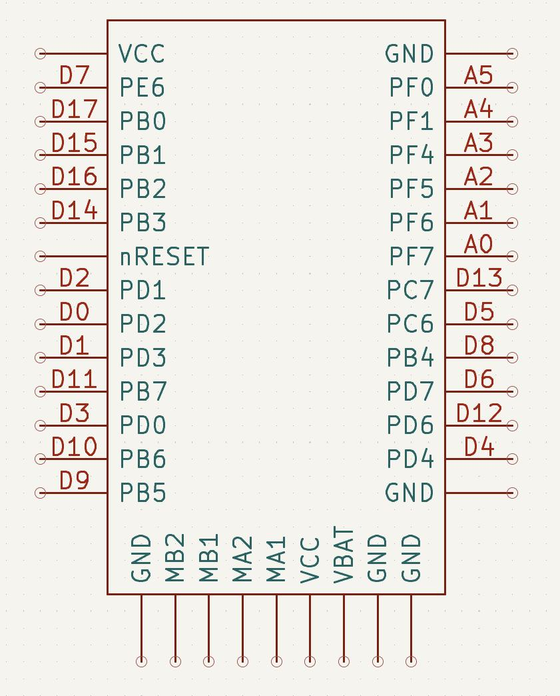
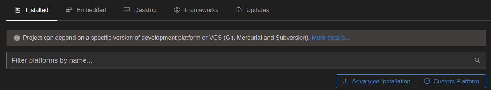
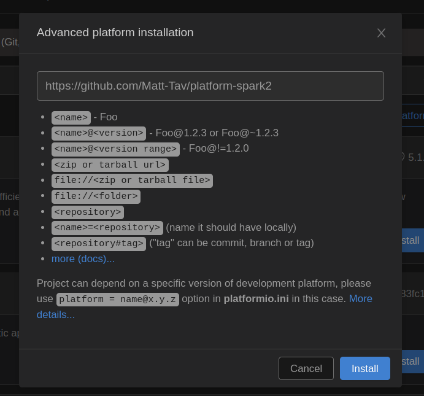

# platform-spark2
A platformio platform definition for the Spark2 breakout board.

## Spark Arduino Pins

    

## Setup
1. Select 'Advanced platform installation' under the 'Platforms' tab

    

2. Add the url to this repository, 'https://github.com/Matt-Tav/platform-spark2'

    

